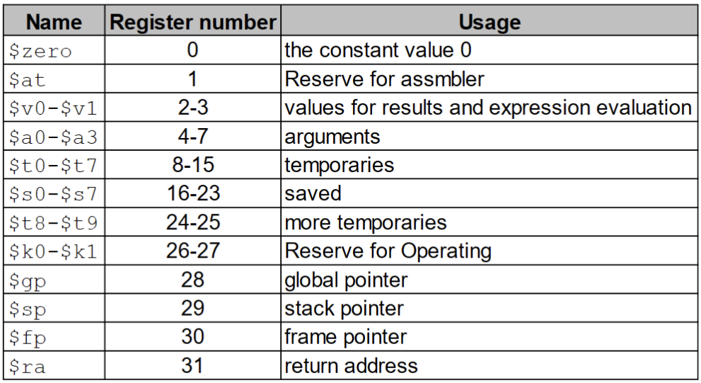
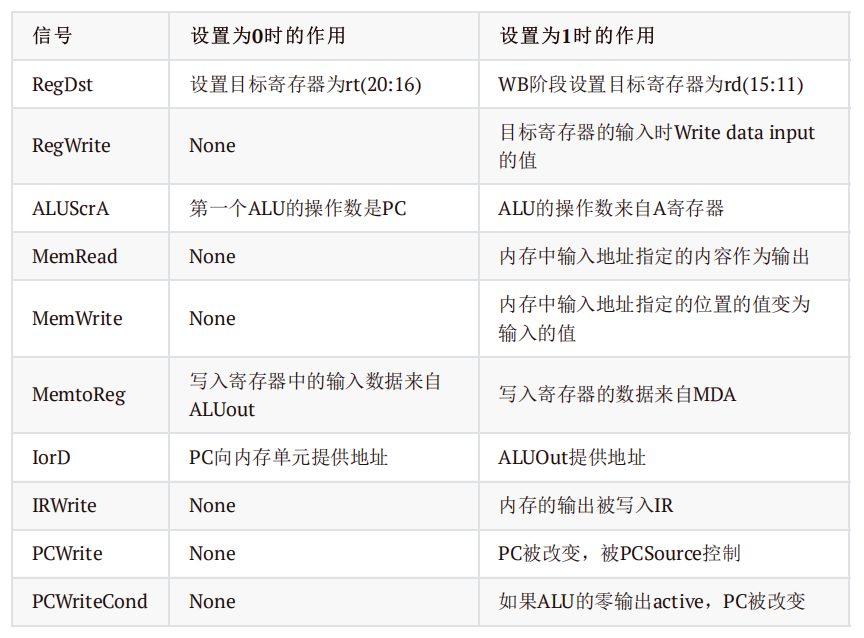
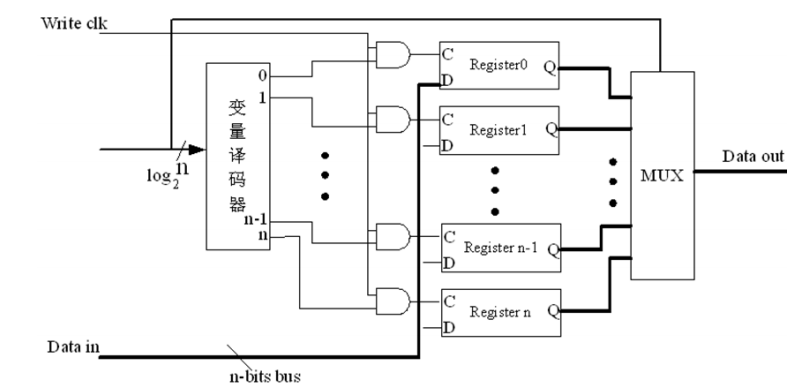
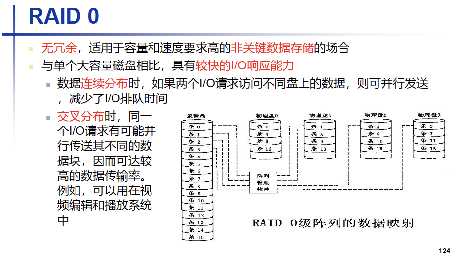

## 计算机系统原理


### 1.计算机抽象与相关技术
- **计算机的5个基本组成部分**
  - Input Output Memory Datapath Control 
- **计算机性能(performance)**
  - 相应时间(Response time/Elapsed time) : 完成一个任务的所有所需要的时间
  - 吞吐率(throughput/bandwith) : 单位时间内完成的任务数量
  - 性能(performance)=1/运行时间(Execution time) : 性能与时间成反比，通过运行时间比较相对性能(relative performace)
  - 摩尔定律：计算机在18-24个月性能提升一倍，但是价格降低一半
  - CPU执行时间(CPU time) : CPU执行本程序所需要的时间 = 用户CPU+系统CPU =周期数*周期时间
  - CPU时钟周期(CPU Clocking) : 固定时间为一周期，处理操作的最小时间单元
    - 时间周期数(clock cycles) 
    - 时间周期(clock period/clock cycle time) ：周期时间长度
    - 时钟速率(clock rate) ：单位时间周期数 = 1/时间周期
  - 指令周期数(CPI) : 单个指令执行所需要的时间周期数 
  - MPIS ：单位时间百万指令数 10^6^
- **其他**
  - 1 B = 1 byte = 8 bits 1kb = 2^10^ bytes  1 MB = 2^20^ bytes 1 GB = 2^30^ B
  - 1 word = 4 bytes = 32 bits 
  - 1 KHz = 1000 Hz  1 MHz = 1000 kHz  1 GHz =1000 MHz
  - A位于65，a位于97
- **计算机的两个关键原则**
  - 指令用数字表示
  - 程序可以储存在内存中当数字一样被读写


### 2.计算机语言
- **寄存器与指令集**
  - 
  - `s`储存数据 `t`临时数据 `ra`返回地址 `a`传递到函数的寄存器变量 `v`储存返回值的寄存器
  - 详细指令关注书本ppt
- **MIPS对于内存的计算**
  - 内存都是以字节(byte)形式计算
  - 按照字(word)的形式存储 于是要乘4转化为字节
  - MPIS是大端字节序(Big Endian) : 按照内存递增储存数据 小端刚好相反
- **进制转化与码**
  - 进制转化：整数相除取余，倒序 小数相乘减一，正顺
  - 补码 : 代替减法运算(2s-Complement Signed Integers)
    - 原来的码取反 + 1 // 2^n^-|x|
    - 0 ，1 ，2 .... 2^31^-1 , -2^31^..... -3 , -2 , -1
    - 符号扩展 ：正数补0 负数补1
  - 原码(Sign and Magnitude)：第一位作为符号位，其他为正常值
  - 反码(1's complement)：正数反码是本身 负数除符号位全部取反
  - 移码(shift):增加一个偏移量使得 最小负数为00...0
    - 偏置常数(bias)=2^n-1^
    - **补码的最高位取反**
- **逻辑运算**
  - 位移运算：只能用无符号数
  - 并(and):全为1则为1,将某数与部分为1的数取并 用于**提取**某数的部分段(mask bit)
  - 或(or):有1为1, 用于改变数**部分改为1**，将要改的与1取或
  - 否(NOT):取反
  - nor ：取或再取反
  - 异或(xor):**伪指令** 指令集中并没有 ,相同为 0 不同为 1
    - 个常用的register内容互换操作 
    ```r
    xor $s1,$s1,$s2 #s1中存的=0为两个相同的=1为两个不同的
    xor $s2,$s1.$s2 #再次异或 若12相同 与0异或 0为0 1为1，若1，2不同 与1异或，1为0 0为1
    xor $s1,$s1,$s2
    ```
- **条件语句**
  - beq 和 bne rs rt offset
    - rs和rt顺序存储
    - 跳转距离为相对地址 PC = PC + 4 + l * 4 (指令行数 可正可负)
  - slt 大小比较语句 : rs < rt -> rd=1  or rd=0
    - 比较时需要注意分别符号数slt 和 sltu
    - 边界检测时常用 sltu r1 r2 r3  判断 0 <= r2 < r3
- **跳转指令**
  - jr(跳转寄存器) 计算方式也是PC = PC +4 +l*4 (l是要跳转到行数)
  - j(跳转指令) ：直接跳转到直接地址
    - 地址计算 ： 在计算距离时时PC = ((PC + 4)& F0000000)|(label<<2)
    - 取PC的前四位 在加上向左移两位的label 
    - 在将汇编转化为机器码时 反过来操作 先舍去前四位 再右移两位
- **R型指令** ：操作和结果都在寄存器中
  - 算数运算(add sub..) 逻辑运算(and or..) 移动指令(sll srl 偏移量为shamt rt为需要跳转寄存器 rd为结果) 寄存器跳转(jr 跳转目标寄存器是rs 其他两个全为0) 条件语句(slt)
  - R型指令的op全部为0，如果不发生位移format也全为0
  - 
- **I型指令** ：一个寄存器和一个立即数组成
  - 地址运算(lw sw) 立即数运算(addi andi,slti..) 条件指令(beq bnq..)
  - lw 和 sw 的地址中 使用的是字节 于是需要把**数组下标乘4**
  - 
- **J型指令**
  - 跳转指令(j jal) jal:$ra =PC+4 再跳转到地址
- **伪指令(Pseudo instruction)**
  - 没有硬件支持的指令 依靠现有指令组合而成
    - blt rs rt label rs < rt -> label
    - move r1 r2 令r1=r2
- **Procedure Instructions 过程调用指令**
  - jal 跳转到函数 jr 跳回主程序
  - `a`传入函数变量 `v`记录返回值  $sp：一个栈指针，MIPS汇编中的栈从高地址往低地址扩展
    - MIPS在函数调用的过程中需要保留 s0-s7 和全局变量 gp 和栈指针 sp 还有fp
  - 栈的存储
    - 栈从高地址往低地址扩展 但是对于单变量还是正常从低到高
  - 在调用函数之前 程序需要存储 `a`寄存器和`at`寄存器 a代表本程序变量 之后要改变成其他的变量 at是本程序返回地址 调用玩jal后会改变 (不要忘记返回之后要读出这些变量)
  - 对于被调用程序 只需要存储需要使用的`s`寄存器
  - 关于内存栈等 如果有位置可以抄一下 不知道考不考以防万一
  - caller-saved和callee-saved寄存器
    - Caller-saved register 易失性寄存器：在将要调用别人时保留变量(a ra t)
    - Callee-saved register 非易失性寄存器，在自己执行时需要保存的变量
    - 
    ```
    判断：callee-saved register: A register saved by the routine making a procedure call.  （x）
    ```
- **字符指令(Character Instruction)和大整数(32-bit Constants)**
  - lb\sb(读取一个byte 按符号补充成32位) lh/sh(读取两个byte 按符号补充成32位) lhu/shu
  - 把一个大整数导入寄存器：
  ```r
  lui rt constant #拷入前十六位 constant是前十六位转化为十进制的值 低十六位清0
  ori rt rt constant #将后十六位的十进制 拷入rt
  ```
- **地址**
  - 
  - 2. ja
  - 3. lw/sw lb/sb lh/sh
  - 4. beq bnq
  - 5. j jal
- **多进程** (个人感觉不重要)
  - `ll`和`sc` rt num（rs） ：ll标记并读某个内存地址 sc是要将寄存器数据存在内存中(条件是在ll到sc之间这个内存地址没被改写过 如果被写过rt=0 没有被写过rt=1，也象征着改写是否成功)
  - 写完之后加一句`beq $t0,$zero,try`判断是否成功

- **其他注意点**
  - 传递参数和获取返回值的寄存器a0-a3和v0-v1一般不直接参与运算
  - 形参超过四个可以用栈来存储参数，在函数中弹出栈，返回值超过2个也要用堆栈，当然可以打破规则用闲置的寄存器传递参数
  - `at`寄存器是系统所用 可以用于伪指令的实现
  - 库链接分为静态链接库和动态链接库，静态链接库可以直接链接，动态链接库作为外部调用(lazy linkage)
  - 加载一个程序:读头文件 建立虚拟地址 在内存中粘贴指令和初始化数据 建立变量 初始化寄存器 跳转值开始位置

- **RISC and CISC**
    - 精简指令系统计算机RISC
      - 简化的指令系统
      - 指令周期短
      - 采用大量通用寄存器，以减少访存次数
      - 采用组合逻辑电路控制，不用或少用微程序控制
      - 采用优化的编译系统，力求有效地支持高级语言程序
    - 复杂指令集计算机CISC
  

### 3.计算机运算技术
- **Addition & Subtraction**
  - 减法转化为补码相加 加法正常按位相加
  - 溢出(overflow)：注意符号位是否改变！正常add指令会有一个overflow的判断，但是addu就没有溢出检验
    - 溢出之后会产生异常exception 跳转至异常解决程序
  ```r
  #用MPIS指令判断是否溢出
  #两个有符号数
  addu $t0,$t1,$t2
  xor $t3,$t1,$t2
  slt $t3,$t3,$zero
  bnq $s3,$zero,notoverflow
  xor $t3,$t0,$t2
  slt $t3,$t3,$zero
  bnq $s3,$zero,overflow
  #两个无符号数
  addu $t0,$t1,$t2
  nor $t3,$t1,$zero #2的n-1-t1,计算还有多少会溢出
  sltu $t3,$t3,$t2
  bnq $s3,$zero,overflow
  ```
  - 异或相当于没有进位的加法
- **加法器设计**
  - 一位ALU：进行and或者or操作
    - OF: overflow 判断是否溢出，最高进位和次高进位的异或
    - CF: CarryOut 进位的值
    - ZF：zero，当结果为0的时候ZF=1，否则是0
    - SF：符号位的判断，正0负1
    - PF：奇偶校验
  - half adder(不能和进位Carryout进行运算)sum = a xor b , carry = a or b
  - 全加器 full adder ：sum = a xor b xor carryin , carryout = a or b + a or carryout + b or carryout
  - 1 bit的ALU的设计：包含AND, OR , ADD三种指令
    - 可以通过输入的值operation来控制输出结果，比如operation=0输出的就是and运算的结果
  - 32-bit的ALU：实际上是32个1bit的ALU连接起来进行运算
    - Carry In和Carry Out会在ALU之间按顺序传递下去，实现加法的进位
  - 1bit ALU的扩展：
    - 支持减法 此时操作码还是3种，参数Binvert控制第二个运算数是否取反
      - a-b = a + !b + 1
      - 
    - 支持nor操作 在a前同样加一个取反元件与一个判断位即可运算
    - 支持比大小a < b =>  a-b < 0 比较大小的操作码为2 加入一个Less输入作为大小判断时的输出
    - 增加元件判断是否overflow (用于32位ALU的最后一位计算)
    - 
  - 加法器的基本原理
    - 完全串行的进位方式，一次运算需要3个与门，2个或门，消耗2份的时间，完成32位全加法需要的时间是一次加法运算的的32倍。算出最后一个进位需要 2n ，算出最后一个结果2n+1(异或门是三个事件延迟)
  - 先行进位加法器(CLA):先行进位(Carry Lookahead)
    - Gi=AiBi——进位生成函数  Pi=Ai+Bi——进位传递函数 Ci+1=Gi+PiCi
    - 时间周期 ：1(计算出所有P和G) + 2(一个与一个或加算出所有进位) + 3(一个异或门 计算出所有和数 前一个异或门在前三个周期已经计算过)

- **Multiplication && Division**
- 二进制乘法
  - 乘法得两个因数分别叫做multiplicand和multiplier
  - 逻辑图：乘数是32位，被乘数，积和ALU是64位
    - 
  - 第二种算法：将商右移代替被乘数左移 于是被乘数直接不变
    - 
  - 第三种：将乘数和商存在一起一起移动
    - 
  - 指令
    - 两个额外寄存器：HI：前32位LO：后三十二位  `mult rs,rt / multu rs,rt`
    - mfhi rd / mflo rd 把HI/LO存入rd
    - mul rd,rs,rd 把最后32位存入rd 适合比较小的数的计算
  - 有符号数的乘法
    - Booth 算法
      - 
      - 当执行减法操作时加上【-x】补码
- 二进制除法
  - 
  - 
  - 带符号除法：基本原则：计算商的时候把除数和被除数都当作正数，得出一个非负数的商，然后根据除数和被除数的符号确定商的符号，在根据关系计算余数比如7/2=3余1，而-7/2=-3余-1，7/-2=-3余1，-7/-2=3余1除数不能为0，负责会overflow
  - **每一种优化算法应该都先移动在计算！！！！**
- **Floating Point浮点数**
  - 
  - Exponent:用移码来表示 移动位数 32：127 64：1023
  - Exponents 00000000 and 11111111 reserved
  - 最小为 1-127 = -126  最大为 254-127=127
  - 无穷表示 1/0 1111 1111 0000000000......
  - 0的表示：1/0 0000 0000 0000000000.......
- **浮点数指令**
  - 32个寄存器f0-f31 double两两组合
    - lwc1, swc1 e.g., lwc1 $f8, 32($sp)
    - 单精度：add.s, sub.s, mul.s, div.s 双精度：add.d, sub.d, mul.d, div.d
    - c.xx.s, c.xx.d，格式中间填写如下eq（相等比较，整型使用beq）, neq（不相等比较，整型使用bnq）, lt（小于，整型slt）, le(小于等于), gt（大于）, ge（大于等于）
    - 与整型区别是没有记录比较结果的寄存器，也没有跳转，于是与要手动跳转
    - Accurate Arithmetic(计算更加准确)
    - 取结果额外两位位Guard和Round位再加一位为sticky（有舍去数位就进位）。
    - 更具倒数第二位奇偶判断四舍五入成偶数


### 4.处理器
- **全流程图**
  - 
    - 寄存器的选择：R型指令 用三个寄存器 rd时用write
    - load：用两个寄存器 rs是第一个寄存器 rt用于write
    - store：两个都用read
    - branch ： 都是read 
    - I型指令的最后十六位需要扩展为32位
- **信号处理**
  - 
    - 两位由ALUop组成（当知道op时，对于branch等指令可以直接决定运算符）
    - 后两位由指令的后六位决定
    - ALU控制器:传入ALUop和Func的末五位
  - 
    - RegDst:控制write是哪一个 0是rt 1是rd
    - Regwrite：控制是否能写入寄存器 0 不行 1可以
    - ALUScr：控制流入ALU的数据 0寄存器 1是立即数扩展
    - MemRead：是否能读取内存值 0 不行 1能
    - Memwrite：能否改写内存值 0 不行 1 能
    - MemtoReg：判断写会寄存器的值是 0 写回ALU的计算结果 1 内存中写回
    - 
- **组合逻辑 combinational logic**
  - 译码器 Decoder
    - 将输入进行映射到对应的输出上，有n输入，2^n^输出，于是位完全译码器。如三位输入两位输出11、10、01、00
  - 多路选择器 MUX
    - 多组数据输入、只输出一组，通过控制信号(selector value)进行筛选
  - 移位器 Shift
    - 固定的移位可以直接通过输入输出线的错位来实现
  - 符号扩展 Sign Extend
    - 通过重复符号位进行扩展
  - 存储器：译码器指定的寄存器单元
    - 指令存储器是只读存储器(Read Only Memory, ROM)
    - 数据存储器是读写存储器(RAM) 可以根据读写控制信号，一次读/写一个32位的数据
  - 寄存器组：
    - 32个32位的存储单元，由两路5位寄存器地址选择读出寄存器中的内容
    - 由5位地址选择器选择写入的寄存器，数据端位32位信号RehWrite 作为允许写入操作的控制信号
    - 
- **状态元件**
  - 与输入和自身的状态有关，**一般输入输出有一个时钟的延时**
- **单时钟CPU数据通道**
  - Memory，Register File，ALU的操作分别需要2，1，2个单位的时间，其他的时间可以忽略不计
  - 
  - Edge-triggered：只在信号改变的边界改变信息
  - 保持时间(prop): 保持时间是指在时钟信号到来后，输入信号需要保持稳定的最短时间。
  - 建立时间：建立时间是指在时钟信号到来之前，输入信号必须保持稳定的最小时间间隔。
  - combinational(clock -to Q):两个边界之间的时间 常用逻辑运算
  - 时钟偏移（Clock Skew）：多条通路的传递时间不同 需要解决这个时间差
  - Cycle Time = Latch Prop + Longest Delay Path + Setup + Clock Skew
  - 单数据通道中，一个时钟周期为8
- **多时钟CPU设计**
  - 分成每个部件在一个时钟中执行
  - 
  - 内存和ALU操作还是2个时间周期 寄存器文件是一个时间周期
  - IR是存指令 MDR存内存数据 A 和 B 是从寄存器中读出的数 ALUout是寄存器记录ALU的结果
  - **分成五个阶段**
    - IF阶段：获取指令
      - 根据PC从内存中取需要执行的指令，放到指令寄存器中
      - PC+4然后把结果返回给PC
    - ID：指令得而译码和register fetch
      - 在需要的时候，读取寄存器rs和rt中的内容
      - 如果是分支指令就需要计算分支的地址
    - EX(BC)：执行，内存地址计算或者分支选择完成
      - ALU根据指令类型执行一种指令
      - 对于内存调用 ALUOut = A + sign-extend(IR[15-0]);
      - 对于R型指令， ALUOut = A op B;
      - 对于分支指令： if (A == B) PC = ALUOut;
      - 对于jump指令， PC = PC[31-28] + IR[25-0] << 2;
    - MEM(WB)：内存访问或者R型指令的完成
      - 对于lw， MDR = Memory[ALUOut];
      - 对于sw， Memory[ALUOut] = B;
      - 对于R型的指令， Reg[rd] = Reg
    - WB：write-back步骤
      - 对于lw指令， Reg[rt]=Reg[IR[20-16]]= MDR;
  - 所以R型指令4割周期，J型指令和分支指令都是3个周期，内存读写都是5个周期
  - 
  - 
  - 
  - 


### 5.存储器
- **访问的局部性原理 （Principle of Locality）**
  - 时间局部性 (Temporal locality)：在相近的时间周期内 可能会多次访问同一个内存地址(概率高) ：循环.. 局部变量（inductionvaribles）
  - 空间局部性（Spatial locality）：访问一个数据之后，会有很大概率访问它附近内存的数据 (数组 指令访问 栈) 
- **芯片和存储器**
  - 
  - 片内地址是按照字节来寻址的
- **计算机一般以字节作为寻址单位，即每一个字节一个地址**
- **多层次的存储**
  - disk（硬盘） ：速度很慢 毫秒级别 不容易丢失数据
    - 
    - 1s=1000ms
    - 访问流程：1.排队等待之前访问结束 2.寻找磁道 3.旋转等待：旋转磁盘找到数据 平均来说是转半圈的时间 计算要乘0.5 4.数据传输 5.其他电路延迟
    - 直接又DMA控制 不使用CPU
    - seek+latency+transfer+controller 一般是毫秒的级别
      - 
  - 闪存（Flash）：速度介于硬盘和主存之间：问次数到达次数限制会损坏
  - 主存（main memory） ： DRAM 不断刷新数据 数据易失
    - 存取时间 T~a~：从CPU传出地址 到 返回数据给CPU所需要的时间
    - 存储周期 T~mc~：存取时间+下一次存取开始前所要求的附加时间
  - cache ： cpu中的存储硬件 SRAM memory  容易丢失数据
  - 其他概念：
    - Block （块）： 数据在层次中传递的最少单元
    - Hit radio（命中率） ：在高层次中读取到相关数据
    - Miss radio（缺失率）：（= 1 - hit radio） 从低层中读取
- **Cache的基本原理**
  - Direct mapped cache
    - (Block address) modulo (#Blocks in cache)
    - Block address = 实际地址 / 块的大小 
    - Valid bit ： 表明数据是否有效 1=present 0=not present
    - 
    - Index : 的位数与cache的block数量有关 当为2m 个block 时 有m位的Index
    - Byte_offset ： 当一个block 存 2m个字（ word ) = 2m+2bytes m bits来找到字的位置 2位来指向4个字节
  - 全相联(Fully associative)
    - 不固定的映射方式，当需要替换的时候就遍历cache中所有的块，覆盖今后最不可能用到的块，这样可以提高cache的命中率
  - 组相联(n-way set associative)
    - 
    - 主存块号/cache组数的商是TAG，余数是index(组的位置)
  - Handing write
    - write-through : 同时写内存和缓存 使用buffer
    - write-Back ：只写缓存 在替换时写回
    - write Allocateion ：write allocate：改写内存之后拷入cache no write allocate：不在cache中分配 直接写入内存
  - 替换策略
    - least-recently-used（LRU）踢出最近最少使用2路记录最近一次访问的目标
  - cache效率的衡量
    - 通常使用AMAT(平均内存访问时间)来检测cache的效率
      - AMAT = Hit time + Miss rate × Miss penalty
      - 
    - CPU时间的计算
      - CPU时间 = (CPU执行的周期数 + Memory-stall 时钟周期) * 一个时钟周期的时间
      - 
- **Deoendability**
  - measures：
  - Reliability（可靠性）：
    - mean time to failure(MTTF) : 平均故障时间 能正常运行的时间
    - mean time between failures (MTBF) =MTTF+MTTR
    - annual failure rate(AFR):年故障率，每年发生故障的概率（描述可靠性更高）
  - Availability（可用性）= MTTF / (MTTF + MTTR) :可用的比例
  - Hamming SEC Code （Single Error Correcting）
    - Hamming distance ：两个位串之间的距离 距离是几 那么不同的位数就是几
  - 奇偶校验法（正常位串多一位）则最小距离为 2
    - 则最小距离为 2
    - 缺陷：只能发现奇数位出错不能发现偶数位出错不能找到发生错误的位置不具备纠错能力
  - Encoding SEC能纠错
    - 矫验码的位置在2的幂次上，其他的位置是正常的数据
    - Bit 1（0001） ：(1，3，5，7，9，11....) 位 -> 位数的二进制 最后一位是1
    - bit 2（0010） ：（2，3，6，7，10，11...）位 -> 位数的二进制倒数第二位是1
    - bit 4（0100） ：（4-7 12-15 ......） 位 -> 位数的二进制倒数第三位是1
    - bit 8（1000） ：(8-15 24-31.....) 位 -> 位数的二进制倒数第四位是1
    - 出错的位数 = 出错校验位1+出错校验位2 +........
  - SEC/DED
    - 除了能实现SEC 中的找到单一位的错误并改正 也同时能找到两位的错误
    - H 为 SEC 中的校验位 p为新添加的校验位
    - H P 都是偶数 没有错误
    - H 是偶数 P是奇数 p位置出现错误
    - H 是奇数 P是奇数 出现单一错误
    - H 是奇数 P是偶数 出现两位错误
  - 校验码的位数
    - 数据位数为 d 校验码为 p 位
    - 2p >=1 + d + p
- **Virtual Memory (虚拟内存)**
  - 一些概念
    - vm 的 block 叫做 page
    - 缺失 叫做 page fault （需要访问的内存不在主存中）
    - 会产生巨大的miss penalty，一般选用write-back策略维持一致性
    - 为了尽可能提高命中率，虚拟存储采取的是全相联的策略
  - 虚拟地址
    - 32 位 分为 Virtual page number(页表序号) 和 offset(偏移量)
    - 
  - Page table 页表（4kib）
    - 
    - LRU（least-recently used）增加一个 Reference bit 如果近期访问过 就是1在一定时间周期之后会更新 1->0 替换时选为 0
    - Size of page table
      - offset 大小 = page 的大小 ：如果是 4kib 则为 212 作为offset 于是就有12位
      - number of page table entries =2^页号^ 如 4kib 为 20 位页号
      - size of page table = 页表入口数量 * 每一个页表的大小
      - 表的项数 = 虚拟地址的空间 / 每页的大小
      - **物理页面的数量是可能与入口数量不同的 物理页面>=入口数量**
      - 
      ```
      判断：In virtual memory, the number of entries of a page table is equals to the physical page number.(x)
      ```
    - TLB (提高页表访问速度) Translation Look-aside Buffe
      - 在 cache 中开辟一个空间内来存page table 硬件或者软件控制
      - 
    - TLB缺失
      - 在内存中存在 直接从内存中拷入cache中 再重新检索 硬件解决
      - page fault ：由os控制从硬盘中读取
      - 
      - 
    - 
    - 
    - Compulsory miss (cold miss)（增加块的大小 通过空间局部性 连带其他数据） : 第一次访问时某一个元素缺失，从未出现在cache中。
    - capacity miss（增加 cahce size） ： cache 所能容纳的数据小于内存 引起缺失，尽管是全相联。所需要的数据大于cache的容量
    - conflict miss （增加相连度可以降低）：在组相联和直接映射中 对同一个入口竞争 一般不发生在全相联中
- **冗余磁盘阵列**(RAID)
  - 
  - 
  - 
  - 用一系列便宜的磁盘代替一个大磁盘，来提高磁盘的效率


### 6.I/O
- I/O 设备的三个要素 ：behavior 表现：输入/输出/存储  partner 参与者：是人还是机器 data rate 数据速度：数据能在I/O设备和主存/处理器之间传输的最大速度
- I/O设备的评价标准 ：带宽 banwidth ：1，一次可以move多少数据2.每个单位时间可以作多少次I/O操作
- **总线bus**
  - 控制线：用于传递各类信号和存储数据线中信息的信息
  - 数据线：传递信息(数据，地址，复杂的指令)
    - 细分的话可以分为地址线和数据线
  - 内存映射I/O方式：内存与I/O系统采用共用的控制、地址和数据线(I/O设备的寻址方式)
    - 内存和接口部件共享一个地址空间，各自拥有不同的地址端，读写的指令和内存读写的指令也是一样的
    - 独立I/O编址：共享地址线和数据线，但是用不同的控制线
  - 总线的工作原理
    - input操作：控制线传输一个写的请求到内存，数据线传递地址,内存主备好之后会给设备发送信号，然后在内存中写入数据，设备不需要等待数据的存储完成
    - output操作：处理器通过控制线发送read请求，数据线传递地址 内存进行数据的访问 通过控制线将数据传输出去，目标设备会存储总线上传递过来的数据
  - 总线分类：内部总线：CPU内部连接各寄存器和运算部件之间的总线 系统总线：CPU同计算机系统的其他高速功能部件(如存储器)等互相连接的总线 I/O总线：中低速I/O设备之间互相连接的总线，比如SCSI
  - 同步传输和异步传输
    - 同步传输(synchronous)：使用时钟和同步协议，每个设备必须在同一个速度和时钟下操作
    - 异步传输(asynchronous)：使用握手协议(handshaking)或者选通(stubing)的策略
      - 此时CPU，接口和I/O设备有不同的时钟周期
  - 总线的缺点：建立通信瓶颈
  ```
  The major disadvantage of a bus is (__C__).
  A：versatility B：Low cost
  C：To create a communication bottleneck
  D：Slower data access
  ```
  - 
- **总线的仲裁 Arbitration**
  - 当多个主设备同时争夺总线的控制权的时候，由总线仲裁部件授权给其中一个主设备
    - 链式查询：所有的设备共用一条总线请求与相应，当总线控制器接到总线的请求之后，总线授权信号串行地在I/O接口之间传递，将控制权交给第一个有总线请求的I/O接口
      - 离中央仲裁器近的设备优先级高 优先级是固定的，如果优先级高的设备请求非常频繁，优先级低的可能一直不能使用总线
    - 计数器定时查询：总线控制器按顺序查询各个接口，如果有请求就响应请求并记录设备的地址
    - 独立请求：每一个共享总线的设备均有一对请求线和授权线，当需要使用的时候就发出请求信息，控制器独立决定响应哪个设备
- **数据传输和控制**
  - 程序查询的方式 ：先检查外设的状态，允许时再进行数据的I/O传送
  - I/O设备的特性 ：1.通过处理器，被多个程序共用 2.使用中断来交流I/O操作的信息 3.需要三种不同类型的交流 (OS必须能够给I/O设备发送命令 当I/O设备完成一个操作或者抛出异常的时候，设备必须通知OS 数据必须在内存和I/O设备之间传输)
- **数据传输的控制**
  - polling 轮询：处理器定期检查设备的状态位，来确定是否到了下一次I/O操作的时间
    - 耗时，当CPU周期性地轮询I/O设备的时候，I/O设备可能没有请求或者还没有准备好
    - 硬件支持要求最低的是轮询
  - interrupt 中断：当一个设备想要告知处理器需要完成一些操作时，让处理器中断 不会检查接口设备的状态位
    - OS可以在数据被读写的时候进行别的task中断驱动的优点就是可以进行并行
  - DMA：设备直接从内存中进行数据传输，绕过处理器
    - 省时间
- **中断**
  - 内部中断：软件、硬件 
  - 外部中断 ：I/O
  - 多个I/O设备发起中断请求的时候，需要确定设备的优先级，优先级高的设备的中断请求先响
  - 键盘使用中断
    - 一般来说数据传输率高的设备(比如磁盘)的优先级比较高，数据传输率比较低的设备的优先级比较低(比如键盘)
  - 判断优先级的方法：
  - 硬件方法：中断优先级判别电路
  - 菊花链(daisy chain)方法：将所有的终端设备串行连接构成优先级电路
  - 软件方法：采用轮询的方式来确定优先级，中断源的
- **DMA**
  - 直接存储器存取 Direct Memory Access，不需要经过处理器，由DMA控制器控制，在外设和主存储器之间进行数据传送，CPU通过DMA控制器对传输方式进行设置，不直接控制传输的过程
  - DMA时期的CPU工作方式：
    - 停止总线和存储器的访问：DMA控制器接管了总线和存储器的控制，CPU停止对于总线和存储器的访问
    - 控制比较简单，但是CPU效率很低
  - 周期挪用：DMA大部分时间用在外部设备的读写中，总线和存储器有相当的时间处于等待状态，CPU利用这段时间访问总线和存储器
    - 效率提高，控制复杂、
  - 轮流访问：两者的折中，将DMA过程划分成较小的周期，由CPU和DMA控制器交替进行总线和存储器的访问