# oop
  - 对象之间相互作用通信是通过消息 ： 对于需要执行的函数内部结构不是消息的一部分。由于cpp将对象封装 通过函数接口。
  - 三大特性：
    - 继承 inheritance
    - 封装 encapsulation
      - 数据和函数捆绑在一起
      - 把细节和数据隐藏起来
      - 只能访问公开的
    - 多态 polymorphic
- #### 变量类型
  - global variable 全局变量：`extern`声明，所有文件使用
  - static global varible 静态全局变量，不能在 cpp 文件之间共享
  - local variable 存储在栈区上 普通变量
  - static local variable 静态局部变量：需要初始化
- #### new and delete
  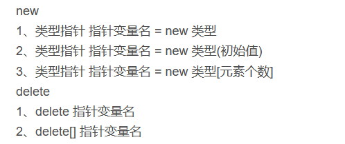
  - new 会执行构造函数  delete 会执行析构函数
- #### 引用 Reference
  - 引用在创建的时候必须要初始化 不能定义空引用
  - 一旦建立联系之后，无法改变联系（与指针不同）
  - 数组没有reference 
  - 没有指针指向reference 
  - 但是可以有指针的reference
- #### 非类中的const
  - 视为常量 初始化后不能改变值
  - const 和指针 pointer
    - `char * const p = "abc";` 地址是常量
    - `const char* p = "abc";`指向 const char 指向可以改变

# class
- ### initialization
  - 初始化顺序：先第用基类构造函数，再调用派生类中成员变量构造函数，最后时调用派生类构造函数
  - #### default constructor 默认构造函数（不需要参数）
    - 当自己写了构造函数后，不会产生
    - 当没有写，系统会自动补充
    - 如下初始化便会产生问题 由于没有对应构造函数
      ```c {.line-numbers}
         public:
        tree(int x)
        {
            a=x;
        };
        tree t1;
        tree a[3];
      ```
    - 但是如果不定义构造函数，直接写就不会出现问题  
  - #### Initializer list 初始化列表
    - onst类型变量必须要初始化列表
      - 在构造函数时：
      - 
       ```c
       private:
        int x,y;
        Point(int a,int b): x(a),y(b){};
       ```
      - 在初始化时的顺序，是与初始定义的顺序相同
      - 在析构时的顺序，是声明的相反顺序
      - 使用初始化列表时，是不需要考虑内容变量的构造函数：
     ```c
     tree(int x,int y,Y m){a=x;b=y;my=m;};
     tree(int x,int y,Y m):a(x),b(y),my(m){};
      ```
      - 第一行当y有自己的构造函数时会报错，由于在赋值时需要先构造一个my来接受变量，但是不满足他的构造函数。
      - 第二行时，对于赋值都是在开始前的，不需要构造函数。
- ### 函数重载(overloading) : 说白了就是参数数量或者类型不同 
  - 函数重载是相同的函数名 类似功能 要求输入形参的**类型或数量**有所不同
  - 形参只是有无 const 的区别不能重载（除了指针和引用）
    ```cpp
    int print(int a) {
    cout << "int";
    return a;
    }
    inr print(const int  a) {
        cout << "int" << endl;
        return 'a';
    }
    ```
  - 返回类型不同不一定是函数重载 ：(**只有返回值类型不同的不是overloading**)
    ```cpp
    int print(int a) {
    cout << "int";
    return a;
    }
    char print(int  a) {
        cout << "char" << endl;
        return 'a';
    }
    ```
  - #### default value
    - **必须是从右往左初始化**
    - 函数定义时如果给形参赋值，在使用函数时传入变量，会改变形参的值 由于是在声明时赋值。
    ```cpp
    void fun(int a=0)
    {
        cout << a << endl;
    }
    INCREMENT( int v = 0, int i = 1 ): v( v ), increment( i ) { }; 
    ```
    - 第二种构造函数时 当没有或者确实参数值时会自动使用初始值
    - 如
    ```cpp
    INCREMENT a(1,2);//正常为 1 和 2
    INCREMENT a; //自动赋值为 0 1
    ```
- ### const object
  - 对象是 const 不是类是 const
  - 只有 const member 才能直接初始化 (`static const a=10` 静态变量才能直接初始化)
  - const member function
    - const 声明写在函数的开头表示函数的返回值类型是 const **返回值不是一个可以修改的左值**
    - 声明在末尾不能修改成员变量 
      - 表达了能被常量对象调用 **非常量成员函数不能被常量成员函数调用**
      ```cpp
      class a{
        void f(int a, int b=10) {cout << a+b; }
		    void f(int a, int b=10) const {cout << a-b; }
      }
      int main(){
        const a m;
        m->f();//调用第二个！！！
      }
      ```
      - 如果删去第二个 程序将会报错！
    - const加在（）之后之前{}
  - constant in class
    - 只能通过初始化列表进行初始化,必须要自己定义构造函数,默认构造函数会报错
    - `static const`不能同时去修饰成员函数
    - 使用`static const` 在类中定义常量（在类中如果要赋初值必须是需要常量）
    ```c
    //Initialize
    class a
    {
      const int t;
      //constant in class
      static const int size = 100;
      int w[size];

      public:
        a(int x):t(x){};//only this way to initialize the constant 
        void print() const {printf("%d",t)};//if don't change the value of the varibles use const
    }
    ```
    - const 类型的函数和非 const 类型的函数也可以构成重载关系(**注意只能放在末端的const**)
    ```cpp
    class A {
        public:
            void foo() {
                cout << "A::foo();" << endl;
            }
            void foo() const {
                cout << "A::foo() const;" << endl;
            }
    };
    ```
- ### const 总结
  - const 变量
    - 视为常量 不能改变值
    - 在类中只用 const 能直接初始化 于是静态常量才能直接在类中初始化
    - 在类中 只能通过初始化列表赋值
  - const function
    - 加在函数之前 表明返回值是 const (只通过加减 const 是不能引起函数重载的)
    - 在member function 中能加在函数之后 表明函数的形参不能发生改变 (只加减这个 const 是可以引起 overloading)
- ### Copy Ctor（拷贝构造）
  - `T::T(const T&)`: 注意一定是要 const 防止const的类变量无法使用拷贝构造
    - `T x1=x2` 相当于 `T x1(x2)`
  - 在定义时赋值 那使用拷贝构造 在定义之后赋值 那么使用=运算符重载
  - **拷贝构造函数也是构造函数**
  - 是将其中变量的值拷贝过去，注意指针：指针是指向同一个位置。
    - 浅拷贝(Shallow Copy):直接复制值
    - 深拷贝(Deep Copy):遇到指针最好自己写一个构造函数，进行一个拷贝；
    ```cpp
    Person(const Person& p)
    {
      name = new char[strlen(p.name)+1];
      strcpy(name,p.name);
    }
    ```
  - 何时调用拷贝构造
    - **在引用和指针时不调用拷贝构造**
    - 在定义时通过直接赋值相同类方式
      ```cpp
      T a;
      T b = a;//两个中类型都行
      T b(a);//满足拷贝构造
      ```
    - 在函数返回传入函数时
      ```cpp
      fun (T k){return k};
      T m=fun(k);
      ```
- ### static
  - **类中的static变量一定要初始化** 不能仅仅声明（由于内存地址是固定的 不能多次初始化）
  - 改变生命周期只会被初始化一次
  - 不能被其他文件调用
  - 在类的外部赋值的时候**不需要说明 static**，但是需要注明 A::，否则就是一个
  - 可以被同文件中的其他函数或者main使用
  - **static members 没有this*这个说法**
    - 所以不能调用instance variable(实例成员)
  - 补充题目 ：**static 不能成为虚函数** 由于是全局性的静态函数 故不存在部分的重构 没有实现虚函数的必要 
- ### Inline function 内联函数
  -  类似于宏但存在区别,在编译时将调用替换:
  - 
  ```c
    inline int f(int a){return a++;}
    int main{int k=f(3);}
    //transform
    int main{int k=(3+1);}
  ```
  - 在逻辑上还是函数调用,但是宏定义是替换,此时会出现区别.
  - 内联函数应当写在头文件中
  - 一般来说简单函数使用内联,只有几行函数
  - 直接定义实现在类里的函数是默认为内联函数
  - 但是当在类外实现时还是需要加inline
  - inline 能够有效避免multiple defination
- ### Inheritance（继承）
  - composition 组合：把其他的类作为自己的成员变量
  - Inheritance：从基类中继承生成派生类 除了基类的函数变量之外，还有自己的私有变量和函数
  ```cpp
  class baseclass
  {
    void print();
  }
  class subclass : public baseclass
  {
    void print();
  }
  ```
  - 派生类构造函数
    - 默认先调用基类的构造函数，再调用派生类的构造函数。析构时先调用自己的析构函数、再调用基类的析构函数。(**基类永远最先构造**)
   ```cpp
   baseclass(int a,int b):a(a),b(b){};
   subclass(int a,int b,int c):baseclass(a,b),c(c){};
   ```
   - 在手动初始化时，如需要初始化基类中的变量 可以使用类似的初始化列表(可以在派生类中调用基类的构造函数)
  - 变量重名使用子类使用自身的 函数重名也只能使用自身的（**父类的所有同名函数对于子类来说是隐藏的**）name hidding(可以使用Base::来调用基类)
    - 但是可以使用父类的指针指向子类
     ```cpp
     subclass m;
     baseclass * k=&m;
     m->print(); //使用的是基类的
     ```
  - 派生类中不能直接访问基类的 private 的变量和成员函数，但是可以通过基类的成员函数来访问这些成员函数和变量 **不能访问但是存在**
  - #### access protection
    - 变量而言：
      - public: 全部可见
      - protected ：子孙可见 友元也可见
      - private： 友元可见
  - 继承关系：
    - 取级别更高的
- ### friends(友元)
  - 友元类
    ```cpp
    class classA
    {
    private:
        int A;

        friend class classB

    }
    class classB
    {
    private:
    int B;

    public：
        int add()
        {
        classA a
        return a.A+B;
        }
    }
    ```
    - B是A的friend 在A中说明友元关系 于是B可以直接调用a的private成员变量
    - **友元关系单向的**：A不能直接用B的private成员变量
  - 还可以定义友元函数（函数为全局的） 全局函数有资格访问类的private成员变量
    ```cpp
    class classB;//提前声明这个类 否则在部分编译器中可能无法通过
    class classA
    {
        private: int a;

        friend int add(classA a,classB b);
    }
    class classB
    {
        private: int b;

        friend int add(classA a,classB b);
    }
    int add(A,B);
    ```
- #### up-casting
  - 把子类视为父类，用一个父类的指针或者引用指向子类（之前已经举过例子）
  - 只能是从父类指向子类
  - 之后就可以让子类使用父类的函数以及private的成员变量
- ### 多态 Polymorphism
  - #### 静态连接绑定
    - 在编译时便绑定好，就是子类直接调用子类的函数
    - 或是不使用虚函数，使用up-casting后子类使用父类的同名函数
  - #### 动态绑定
    - 使用虚函数的绑定
    - 不需要操心类型 会自动决定正确类型 
    - 使用父类指针或者引用指向子类 调用重名函数后 仍然是子类本身的函数
  - #### 虚函数 virtual
    - **基类和子类中的函数定义有相同的参数个数和类型  关键字也应当相同**
    - 当基类中有 `virtual` 时便是虚函数 ，衍生类中是否使用virtual声明不影响
    - 当基类中不使用 `virtual` 时，无论衍生类是否使用都不发生多态
    - 把**析构函数也需要是虚函数**，在删除变量时无法准确找到对应的类，会导致内存泄漏
    - **构造函数一定不能是虚函数**，此时虚表还没建立
    - 在构造函数中也不要使用虚函数 
    - 其中display就没有多态(由于没有const关键字)
        ```cpp
        #include<iostream>
        using namespace std;
        class Base{
        protected:
            int x;
        public:
            Base(int b=0): x(b) { }
            virtual void display() const {cout << x << endl;}
        };
        class Derived: public Base{
            int y;
        public:
            Derived(int d=0): y(d) { }
            void display() {cout << x << "," << y << endl;}
        };
        int main()
        {
        Base b(1);
        Derived d(2);
        Base *p = &d;
        b.display();
        d.display();
        p->display();
        return 0;
        }
        ```
    - 在基类中只是用于声明，但是没有实现（也可以定义），具体实现是根据子类来判断的
    - 在衍生类中重写 编译器自动决定使用什么函数
  - #### pure virtual function (纯虚函数)
    - `virtual fun(int a)=0;`
    - **有纯虚函数便是抽象类**
      - **不能创建该类的对象**，可以创建**指针**，只能当作基类，是一个概念化的东西。
  - #### Overriding
    - override : 父类和子类之间有完全一样的函数时,告诉编译器是重写的函数（如果只是声明却不重写就会报错）
      - 可以在其中调用父类的function
    ```cpp
    virtual void fun();//再父类中定义一个虚函数
    void fun() override;//在子类中对虚函数进行重写
    ```
    - overload ： 一个类中存在名称相同内容不同的函数时
        ```cpp
        void fun();
        void fun(int i);
        ```
  - 当函数类型是class的**指针或者引用**的是时候可以发生多态，同时改变函数定义
    ```cpp
    class base
    {
        public:
        virtual base* funa();
        virtual base& funb();
        virtual base func();
    };
    class sub
    {
        public:
        virtual sub* funa();
        virtual sub& funb()；
        virtual sub func(); //不发生多态
    }
    ```
  - 当你重写一个overload的function时 需要重写所有形式
    ```cpp
    base:
    virtual void fun();
    virtual void fun(int k);
    sub:
        void fun();
        void fun(int k);
    ```
    - **注意以下情况**，k的值是在初始化时就已经确定了！(所以k=1):使用基类的默认参数 派生类会被忽略
    ```cpp
    base :
        virtual void fun(int k=1);
    sub:
        void fun(int k=0);
    sub m;
    base *k=m;
    m.fun();//此时k为1 执行的时sub的fun（）；
    ```
- #### 虚函数的实现方式：虚函数表 virtual table
  - 每一个有虚函数的类都会有一个虚函数表，该类的任何对象中都存放着虚函数表的指针，虚函数表中列出了该类的**虚函数地址**
    - 虚函数表是一个指针数组，里面存放了一系列虚函数的指针
    - 虚函数的调用需要经过虚函数表的查询，非虚函数的调用不需要经过虚函数表
    - 一个类只有一张虚函数表，每一个对象都有指向虚函数表的一个指针__vptr
    - 当在直接**赋值**时**VPTr是不发生变化**的,不发生多态
    ```cpp
    Shape *shape;  //基类指针
    Shape a(1, 2);//初始化
    a.area();  //virtual function
    Rectangle rec(10,7); //两个子类的初始化定义
    Triangle tri(10,5);
    a = rec; //进行赋值操作
    a.area(); //此时调用的还是基类的函数
    ```
  - **如果虚函数里还需要调用其他函数，调用的规则一样**
  - 虚函数会给函数加上一个新的参数，是一个指针，占用 4 字节，**类多一个四字节参数**
  - 虚函数需要借助指针和引用达到多态的效果
    - 如果不使用指针或者引用 可以默认为静态绑定 在编译时即可确定调用函数
- ### 强制类型转换
  - static_cast<type>(expression)
    - 非多态转换(不包含虚函数) 
      - 把指向派生类的指针转化为指向基类
      - 能把指向基类的指针指向派生类(不安全)
    - 基本类型转换(非指针(能转成void*) 非引用)
    - 不能转化const类型
  - dynamic_cast<type>(expression)
    - 不是在编译时完成 而是在运行时完成
    - 失败返回null
    - 多态类型转换(通过虚表进行转化 要有虚函数 没有会报错)
    - 允许子类转化为父类
  - const_cast<type>(expression)
    - 用于增减const（主要使用指针和应用）
  - reinterperet_cast<type>(expression)
    - 整型转化指针之间的转化 指针转化为整型
- ### 运算符重载 overloaded operators
  - 不能被重载：`. :: :? .* sizeof typeid static 强制类型转化符号`
  - 定义可以在类中 也可以在全局的函数
    - 在类中：符号左值作为本身*this，第二个作为参数输入
      - 对于左值不能进行类型转换，只能转化右值
      - **= () [] -> ->* 必须是成员函数**
    - 在外部两个都是参数
  - 返回值类型根据运算符来决定的 **而不是由形参类型决定的**（形参可能有多种类型 或者是const类型 ）
    - `+-*/%^&|~` :`const T operatorX(const T&i,const T&r);`
    - ` ! && || < > <= >= ==` : `bool operatorX(const T&i,constT&r);`
    - `[] += = ` : `T& operator X(int i/T &i)`
  - **返回引用的还有+= = []等操作(返回结果必须是可以修改的左值，于是不能加const)**
  - **编译器会提供默认赋值运算符=**
    - ++ and --
      - 前置： `K& K::operator++()`
      - 后置： `const K k::operator++(int)`int 默认传入0
    - 在拷贝时 如果类中有指针 就需要自己写定义= 开辟新空间 注意a=a
    - 重载（）运算符
    ```cpp
    struct F
    {
      void operator()(int x) const{
        std::cout<<x<<endl;
      }
    }
    F f;
    f(2); //类似于函数使用 f.operator()(2);
    ```
  - #### 类型转换
    - ##### 单参数构造函数
      - 给一个转换的接口：
      - 进行隐式的类型转化
      ```cpp
      class B
      {
        int k;
      }
      class A
      {
        int a;
        A(const B&);
      }
      A a;
      B b;
      a=b;
      ```
    - 但当 在`explicit A(const B&);`加入关键字 explicit 之后就只能按照这个形式进行显性的操作！
  - ##### 定义一个转换运算符
    - 定义 ： operator T()  将本类类型转化为其他类
      - 注意：是没有返回类型的
      ```cpp
      operator double()const{
        return (double) a;
      }
      ```
    - **注意**：在使用时需要注意定义类顺序 需要转化的放在后面 目标类型放在前面！！ 

  - ##### 重载->运算符
    - 满足成员变量使用->
     ```cpp
    class A{
        public:
            int a;
            A(int k) : a(k){};
            A *operator->() { return this; }
    };
    int main(){
        A n(10);
        A *m = &n;
        cout << n->a << endl;
        cout << m->a << endl;
    }
     ```
     定义时 ： `T * operator->(){}`
- ### 运算符重载简单总结
  - `+-*/%^&|~` :`const T operatorX(const T&i,const T&r) const;`
  - ` ! && || < > <= >= ==` : `bool operatorX(const T&i,constT&r) const;`
  - `[] ` : `T& operator X(int i)`
  - `+= = `: `T&operator X(const T &i);`
  - `++ --`: pre:`T& operator++();` post:`T operator++(int i);`
  - `->` : `T* operator->(){return this;}`
  - `类型转化`：`operator double(){}`
  - `>>`:`istream& operator>>(istream &is,T& k);`
  - `<<`:`ostream& operator<<(ostream &os,T& k);` **输入输出流别加const**
- ### stream 流
  - Extractors提取（cout） Inserters插入（cin） Manipulators操纵器（endl）
  - cin cout cerr(立即输出) clog（一次性写入）
  - 读取跳过空白字符
  - 读取错误:
    ` setstate(std::ios::failbit);`
  - 输入输出流重载
    ```cpp
    istream &operator>>(istream& is, T&)
    {
      return is;
    }
    ```
    - get不消耗分隔符 ：注意当数组大小和读取大小相同时 会少读一个为\0 `cin.get(字符数组，字符数量，终止字符)`
    - getline 会读分隔符 `cin.getline(字符数组，字符数量，终止字符)` 读取停止后其中的换行不在缓冲区中
- ### templates(模板)
  - ##### function template
    - 函数模板需要**实例化 (instantiation)**之后再使用，如果没有被调用就不会被实例化
    - 直接当作正常类型使用
    ```cpp
    template <class T> //or template <typename T>
    T fun(T &a)
    {
      T b=a;
      return b
    }
    ```
    - 根据传入的类型 会生成一个对应类型的函数 （把模板转化）
    - **不允许隐式类型转化** 但是模板和正常可以同时存在
      - 匹配机制 ：1.先找完全匹配  2.模板函数 3.类型转化使用其他类型正常函数（不是模板其他已经定义了的）
    ```cpp
    template <class T>
    void fun(T a,T b){};
    void fun(double a, double b){};
    string a,b;
    fun(a,b); //template
    double a,b;
    fun(a,b)//double
    string a;
    int b;
    fun(a,b);//error
    ```
  - #### class template
    - 类似于函数模板
    ```cpp
    template<class T>
    class m{
      public:
       void fun();
    }
    template <class T>
    void m<T>::fun(){};
    ```
  - Expression parameter
  - template 中可以不只一个类型 也可以嵌套
    `template<class A,class B>`
  - 也可存在非参数类型 constant的变量default value
     `template <class B=int ,int k=100>`
    - 使用时可以< int , 30 > or <int>//默认为100
    - 会导致数据膨胀，每改变一个k大小 会新初始化函数
  - inheritance
    - 继承一个非模板类
      ```cpp
      template<class T>
      class a:public base{};
      ```
    - 继承一个模板类
    ```cpp
    template<class T>
    class a:public base<T>{};
    ```
    - 非模板类也能继承模板类
    ```cpp
    class a:public base<A>{};
    ```
    - 奇异循环模板
    - 能从基类调用子类的函数
    ```cpp
    template <class T>
    class Base {..};
    class D:public Base<D>{..};
    ```
  - #### static member
    - 当类型种类发生改变时 s**tatic变量会改变 （static跟随类型变化）**
    - 注意需要初始化变量
  - #### 模板类的定义和实现在同一个 header 文件中
  - #### 模板特例化（specialization）
    - 对模板的一个独立定义，更加细化提供参数类型。
  - ##### 全特化(full specialization)
    - `template<>` 表明直接提供所有参数类型，为模板提供实参
    - 使用之前必须有一个已经声明的模板与之匹配
  - ##### 偏特化(partial specialization)
    - `template<class T> class A<T*>` 指明使用指针类型 或者指明使用引用类型
    - 或者多个类型时 部分被初始化
  - ##### 调用顺序
    - 先找完全匹配的类型
    - 指针或者引用先找偏特化
    - 最后再调用普通类模板
- ### STL
  - **不能直接用`cout`输出**
  - vector 的 size 和 capacity
    ```cpp
    vector <int> v(151);
    v[10]=10;
    //此时size和capactiy都是151
    v.push_back(10);
    //size时152但是capacity是302
    v.resize(1000);
    //size 和capicity都是1000
    v.reserve(2000)
    //size 还是1000 但是capicity 2000
    v.claer();
    //size = 0 capicity = 2000
    v.shrink_to_fit();
    //把capicity缩小到size
    ```
  - 通用操作
    - 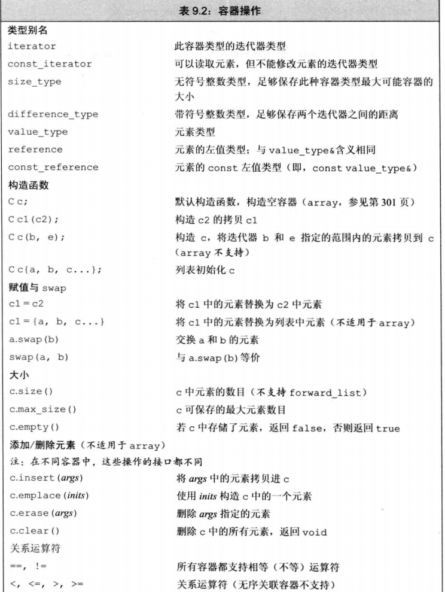
  - 容器赋值运算（assign只能用于顺序容器）
    - 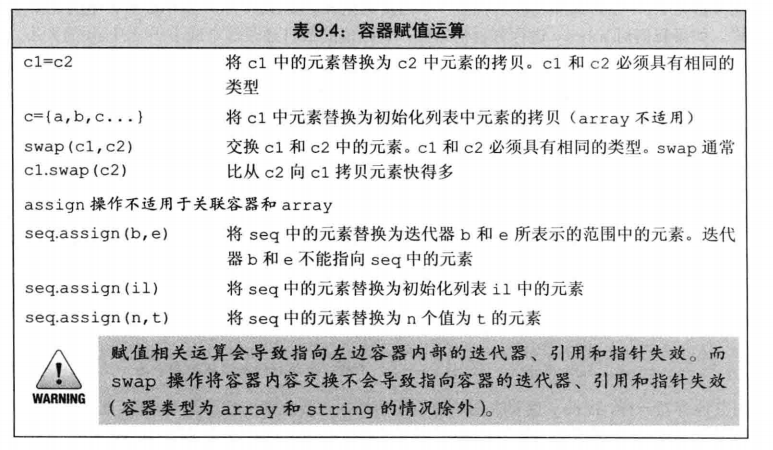
    - swap:不是进行拷贝粘贴，而是交换容器结构，常数时间复杂度，容器大小不同也能进行交换。
    - copy(a,b,c) a,b为拷贝的迭代器范围 c为粘贴位置的迭代器初始值
    - 
    ```cpp
    vector<char> a1(10, '1');
    vector<char> a2(15, '2');
    swap(a1, a2);
    for(auto k:a1)
        cout << k << ' ';
    cout << endl;
    vector<char>::iterator m= a2.begin();
    for (; m != a2.end(); m++)
        cout << (*m) << ' ';
    cout << endl;
    ```
- ### 迭代器
  - `begin() and end() `通常是首元素的迭代器和尾元素的迭代器。
  - 当begin==end时认为容器为空
  - 用法比较类似于指针 指向元素 支持++等操作 能顺序遍历容器
    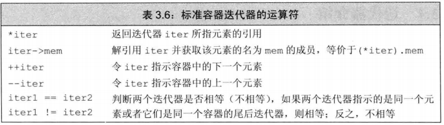
  - 迭代器定义使用`iterator and const_iterator`(区别在于能否改变元素的值): 
  ```cpp
  vector<int>::iterator it;
  vector<int>::const_iterator it;
  ```
  - #### 使用迭代器的循环体，不要向容器中添加元素！！！
  - 想知道迭代器中传入的类型的值
    - 直接让用户传参数
      ```cpp
      template <class I,class T>
      void func(I iter,T *iter);
      ```
    - 但是当需要函数返回类型也为迭代器中的类型时 就需要明确知道类型名称
    - **通俗点说，一个函数的返回值 希望是一个类模板中传入的类型。**
      - 在迭代器结构中定义 `typedef T value_type`
      - 在使用时 `typename I :: value_type func(I iter)`
      - 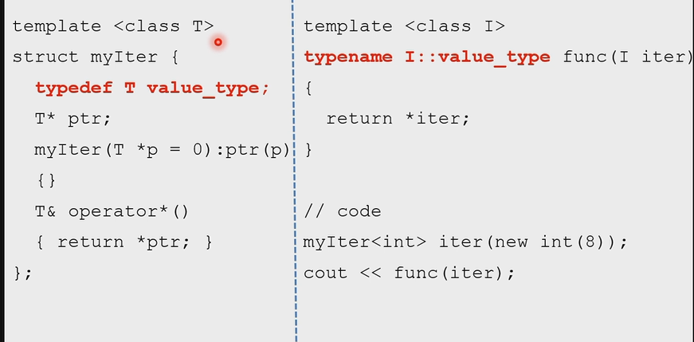
      ```cpp
      template <class I>
      class Base
      {
      public:
        const int m = 2;
        typedef I value_type;
            Base() {};
      };
      template<class T>
      typename T::value_type func(T k)
      {
        return k.m;
      }
      int main()
      {
        Base<int> k;
        auto t=func(k);
        cout << t << endl;
      }
      ```
    - 当需要知道的是一个指针时
    ```cpp
    //正常传入的类型
    template <class I>
    struct iterator_traits{
      typedef typename I::value_type value_type;
    }
    //传入指针类型
    template <class T*>
    struct inerator_traits{
      typedef T value_type;
    }
    template<class I>
    typename iterator_traits<I>::value_type
    func(I iter){
      return *iter;
    }


    ```
    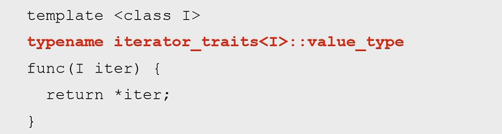
  - #### 自定义迭代器
    - 需要实现++ == * ->等运算符操作
    - 注意：-> 返回值为 ： 是一个指针 返回值为 ：`&(**this)`
- ### 顺序容器
  - #### vector
    - 只提供大小初始化，所有元素自动赋初值为0 `vector<int> k(10)`
    - `push_back()`向其中添加元素
    - 之前所说得range for语句同样可用
  - ##### arry（比较特殊 应该不用掌握）
    - 大小是类型的一部分：`array<int ,42>;`
  - #### string
    - 找元素操作：
      - 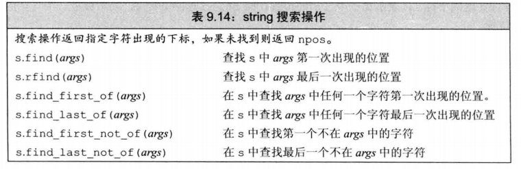
      - 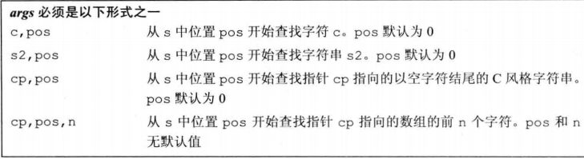
  - #### 顺序容器操作
    - 添加元素：只考虑常用的vector list deque
      - `push_back()` 都适用 向最后添加元素
      - `push_front()`deque 像开始添加
      - `insert(p,t)`迭代器p之前位置添加一个元素 返回值为插入元素的迭代器
      - `insert(p,n,t)`添加n个元素
      - `insert(p,a,b)`添加ab之间的元素
    - 访问元素
      - `back()` 尾端元素
      - `front()` 首元素
    - 删除元素
      - `pop_back()`都支持 删除最后一个元素
      - `pop_front()`deque操作
      - `earse(p)`删除迭代器所指向元素 返回下一个元素的迭代器
      - `earse(a,b)`删除ab迭代器之间元素
    - 改变容器大小
      - `resize(c) resize(n,t)`大小改为c或者n 后者将添加的元素初始化为t。
- ### 关联容器
- 常用map
- **关键字定义必须要有比较方法 存在<的运算**
  - 有序容器会对加入的元素进行按顺序存储
  - #### map
    - 键和值 `map<string,int> k` k[m]=n,m为string n为int
    - 初始化{key，value}
    - 在map中使用迭代器时，会得到pair类型的变量 分别存key和value
  - #### pair
    - 两个结构成员 `pari<string,int> a（"aa",1）;`
    - 操作： `a.first a.second`得到两个成员变量
  - #### set
    - 只  保存关键字
- 添加元素
  - 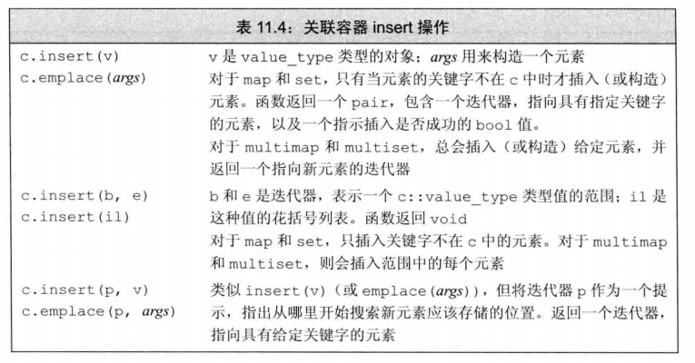
- 删除元素
  - 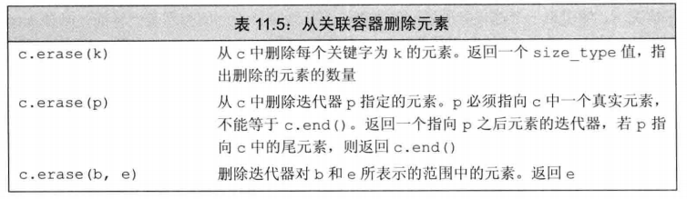
- 下标操作
  - 注意：**使用不在map中的下标会自动向其中添加一个元素，在找元素的时候不能直接使用**
  - 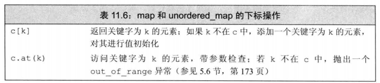
- 访问元素
  - `c.find(k)`返回一个迭代器，找到第一个k的元素 如果没找到的化会返回end()迭代器
- 找到元素
  - `count("aaa") or contain("aaa")`返回1或者0
- ### Exception(异常处理)
  - `try{} catch(){}` 遇到异常 `throw  `
  - `catch(...)`能捕捉到所有的异常 必须放在所有catch之后
  **异常按级传递 当出现异常在该作用域没有处理 就会退栈到上一个作用域 如果到最外层都没处理 就终止程序**
  - 异常语句之后的语句是不执行的 除了析构语句
  - 匹配catch的语句也是按照书写顺序 父类可以匹配子类异常
  - **异常类型需要严格的匹配**:包括double和int
  - `void func() noexcept` 当不会有异常时 可以写关键字
  - `throw()`  空括号就等于noexcept 空号中有异常名 表示只能返回这种异常
  - 在throw前先析构所有成员变量
- #### 在构造函数中的异常
- 构造函数出现异常 是不会调用析构的 于是需要手动free
  - 使用smart pointer ：和第二种情况是一样的 智能指针也是一个类
    ```cpp
    //first situation
    class A{
      private:
        int *a;
      public:
        A():a(new int[10]){
          cout<<"A()"<<endl;
          if(true){
            delete[] a;
            throw 2;
          }
        }
        ~A(){
          delete[] a;
          cout<<"~A()"<<endl;
        }
    }
    //second situation
    class Wrapper{
      private:
        int *a;
      public:
        Wrapper(int *k):a(k){
            cout << "Wrapper()" << endl;
        }
        ~Wrapper(){
            delete[] a;
            cout << "~Wrapper()" << endl;
        }
        
    };
    class B{
        private:
            Wrapper b;
        public:
            B():b(new int[10]){
                cout<<"B()"<<endl;
                if(true){
                    throw 2;
                }
            }
            ~B(){
                cout << "~B()" << endl;
            }
    };
    //注意 如果在主函数中没有写接收异常的话 不会调用wrapper析构函数
    //原因在于程序被 terminate 不再调用析构函数 是直接推出程序 导致内存泄漏
    //third situation 

    class C{
        private:
            unique_ptr<int[]> up; 
        public:
            C() : up(new int[10]()){  // up(make_unique<int[]>(10)) is better
                cout << "C::C()" << endl;
                if (true){ // anything indicating a failure
                    throw 2;
                }
            }
            ~C(){
                cout << "C::~C()" << endl;
            }
    };
    ```
  - **析构函数不要抛出异常 会导致 terminate**
  - **在catch时最好是用引用接收 同时能保证多态**
- ### smart pointers
  - 是一个类 能帮助用户自动free指针
  - `unique_ptr` : 独占 不能同时指向一个对象 （不允许指针的拷贝）
    - 初始化： `auto a = make_unipue<int>()` or `unique_ptr<A> b`
    - 只能通过交换 `unique_ptr<int> b = move(a)`
  - `shared_ptr` ： 可以有多个指向一个对象 `get`获取原始指针 `use_count`查看对象指针数量
  - `weak_ptr`是没用重载 * 和-> 操作符，没有普通指针具有的行为 **weakptr 不会造成指针引用计数的增加**
- ### 补充：：
  - #### for(range for)语句
  ```cpp
  string str("sfdsfs");
  for(auto c : str)
    cout<<c<<endl;
  //如果压迫改变值得化就需要引用
  string str("sfdsfs");
  for(auto &c : str)
    cout<<c<<endl;
  ```
  - #### copy（a,b,k）
    - a,b需要拷贝的元素的范围，如迭代器等
    - k是目标容器可以是：`ostream_iterator<int>(cout,",")`
    - 这样输出时 注意最后还有一个逗号
  - #### typedef  也能用 using
  - #### multiple inheritance(多重继承) ：子类会有多个父类
  - #### namespace
  - loose Coupling  低耦合
  - high Cohesion  高内聚

